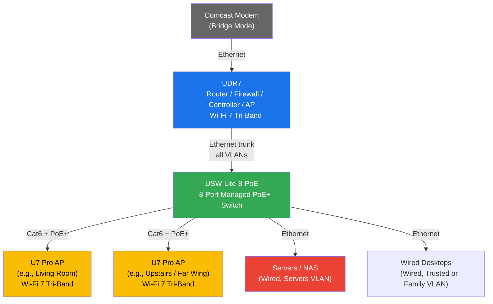
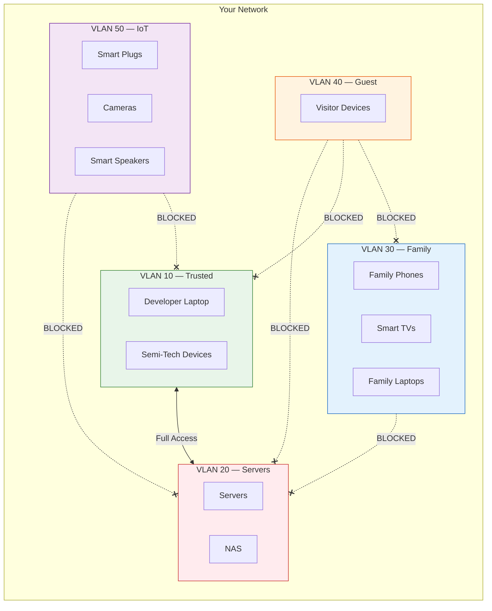
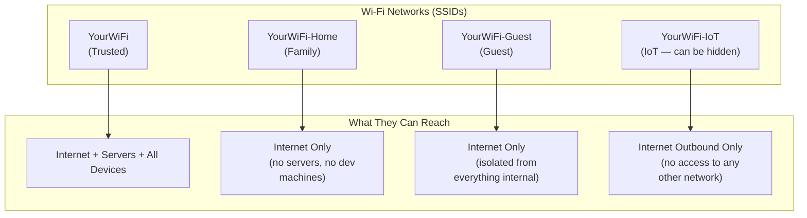

# Home Network Plan: UniFi Wi-Fi 7 with VLAN Segmentation

## Overview

This document describes a home network built on the **Ubiquiti UniFi** ecosystem. The
network provides whole-home Wi-Fi 7 mesh coverage with **isolated network segments**
(VLANs) so that different types of users and devices are separated from each other. Guest
devices can't touch internal servers. Non-tech family members can't accidentally stumble
into developer infrastructure. IoT devices are sandboxed away from everything.

All of this is managed through a clean web UI — no command line required for day-to-day
operation.

---

## Hardware Shopping List

| # | Item | Role | Price | Buy |
|---|------|------|-------|-----|
| 1 | **UniFi Dream Router 7 (UDR7)** | Router, firewall, controller, Wi-Fi 7 AP | $279 | [Ubiquiti Store](https://store.ui.com/us/en/products/udr7) / [Amazon](https://www.amazon.com/Ubiquiti-Networks-Dream-Router-Wi-Fi/dp/B0DZ8G8ZZ6) |
| 2 | **UniFi U7 Pro** (x2) | Wi-Fi 7 tri-band access points (mesh extenders) | $189 each | [Ubiquiti Store](https://store.ui.com/us/en/products/u7-pro) / [Amazon](https://www.amazon.com/Ubiquiti-Networks-Adapter-Included-U7-Pro-US/dp/B0CW1VSBXJ) |
| 1 | **UniFi Switch Lite 8 PoE (USW-Lite-8-PoE)** | PoE+ switch to power the APs and connect wired devices | $109 | [Ubiquiti Store](https://store.ui.com/us/en/products/usw-lite-8-poe) / [Amazon](https://www.amazon.com/Ubiquiti-Switch-Gigabit-802-3at-USW-Lite-8-PoE/dp/B08KC6KT1F) |
| — | **Cat6 Ethernet Cable** (as needed) | Wired backhaul runs from switch to each AP | varies | Any Cat6 or Cat6a cable, sold at Amazon, Monoprice, Home Depot, etc. |

### Total: ~$766

> **Why U7 Pro instead of U7 Lite?** The U7 Pro is tri-band (2.4 + 5 + **6 GHz**) so every
> AP in your house can serve the fastest devices on the empty 6 GHz highway. The U7 Lite
> ($99) is dual-band (no 6 GHz) — it works fine, but since you're running Ethernet to each
> AP anyway, might as well get the better radios. You can mix and match if budget matters
> (e.g., U7 Pro in the living room, U7 Lite in a back bedroom).

---

## What Each Piece of Hardware Does

### UniFi Dream Router 7 (UDR7)

This is the brain of the entire network. It does **five jobs in one box**:

1. **Router** — Connects to your Comcast modem (in bridge mode) and gets your public IP.
   It performs NAT (Network Address Translation) so all your internal devices share that
   one public IP.

2. **Firewall** — Inspects all traffic between network segments (VLANs) and enforces
   rules like "Family devices cannot reach the Servers network." Also protects you from
   inbound internet threats. Optional IDS/IPS (intrusion detection) if you want it.

3. **UniFi Controller** — The management software that runs on the UDR7 itself. This is
   the web UI where you configure everything: networks, VLANs, firewall rules, SSIDs, and
   monitor all devices. It auto-discovers and adopts your APs and switch. No cloud account
   required — runs 100% locally.

4. **Wi-Fi 7 Access Point** — The UDR7 has built-in tri-band Wi-Fi 7 radios
   (2.4 + 5 + 6 GHz), so it broadcasts all your SSIDs itself in addition to the
   dedicated APs.

5. **PoE Switch** — Has one PoE port (802.3af, 15.4W) for powering a single small device.
   Not enough for the U7 Pros, which is why we need the dedicated switch.

### UniFi U7 Pro Access Points (x2)

These are your **mesh extenders** (Ubiquiti calls them Access Points / APs). Each one:

- Broadcasts **all of your SSIDs simultaneously** (Trusted, Family, Guest, IoT) — you
  don't need separate APs per network
- Handles **seamless roaming** — as you walk from one end of the house to the other, your
  phone silently switches from one AP to the next without dropping
- Supports **Wi-Fi 7 tri-band** (2.4 + 5 + 6 GHz) with features like MLO (Multi-Link
  Operation) and 4K-QAM
- Has a **2.5 GbE uplink port** — connects via Ethernet back to the switch for full-speed
  wired backhaul (no wireless bandwidth penalty)
- Powered via **PoE+** (802.3at) — a single Ethernet cable carries both data and power, so
  you only need to run one cable to each AP, no power outlet needed at the AP location
- Mounts on a **ceiling or wall** — designed to be unobtrusive

### UniFi Switch Lite 8 PoE (USW-Lite-8-PoE)

This is a **managed network switch** with **Power over Ethernet**. It does two things:

1. **Powers the APs** — 4 of its 8 ports supply PoE+ (802.3at, up to 52W total), which is
   enough to power both U7 Pros simultaneously. One Ethernet cable per AP = data + power.

2. **Connects wired devices** — The remaining ports can connect servers, a NAS, desktop
   PCs, game consoles, or anything else that benefits from a wired connection. Each port
   can be assigned to a specific VLAN, so your server plugged into Port 3 lives on the
   Servers VLAN and your kid's gaming PC on Port 5 lives on the Family VLAN.

3. **VLAN-aware** — Since it's a managed switch (not a dumb switch), it understands VLAN
   tags. Traffic from different networks can flow through the same cable between the UDR7
   and the switch without mixing.

> **Why not a dumb switch?** A dumb (unmanaged) switch can't do VLANs. All your careful
> network segmentation would break — every wired device would end up on the same flat
> network. The USW-Lite-8-PoE is managed and auto-configures itself when adopted by the
> UDR7 controller.

### Ethernet Cables

You'll run **Cat6 or Cat6a** Ethernet cable from the switch to each AP location. Cat6
supports 2.5 GbE (and even 5/10 GbE at shorter distances) which is more than enough. Cat6a
gives extra headroom for 10 GbE if you ever upgrade, but for a typical home run (under 50
meters / 160 feet), Cat6 is perfectly fine and cheaper.

Since the APs are powered via PoE, the Ethernet cable is the **only cable** you need to run
to each AP — no power outlet required at the AP itself.

---

## Network Architecture

### Physical Layout



### VLAN / Network Segmentation



### What Each SSID / VLAN Is For



---

## VLAN Details

| VLAN | ID | Subnet | SSID | Who Uses It | Internet? | Servers? | Other VLANs? |
|------|----|--------|------|-------------|-----------|----------|--------------|
| **Trusted** | 10 | 192.168.10.0/24 | `YourWiFi` | Developer, semi-tech people | Yes | **Yes** | Yes |
| **Servers** | 20 | 192.168.20.0/24 | None (wired only) | Servers, NAS, dev infra | Yes | N/A | Only from Trusted |
| **Family** | 30 | 192.168.30.0/24 | `YourWiFi-Home` | Non-tech household members | Yes | **No** | No |
| **Guest** | 40 | 192.168.40.0/24 | `YourWiFi-Guest` | Visitors | Yes | **No** | **No** (fully isolated) |
| **IoT** | 50 | 192.168.50.0/24 | `YourWiFi-IoT` | Smart home devices | Yes (outbound) | **No** | **No** |

---

## Firewall Rules

These are configured in the UniFi web UI under **Settings > Security > Firewall Rules**.

| Rule | Action | From | To | Purpose |
|------|--------|------|----|---------|
| Allow Trusted → Servers | **Allow** | VLAN 10 | VLAN 20 | Developer can SSH, access NAS, manage servers |
| Block Family → Servers | **Drop** | VLAN 30 | VLAN 20 | Non-tech users cannot reach servers |
| Block Guest → All RFC1918 | **Drop** | VLAN 40 | All private IPs | Guests get internet only, nothing internal |
| Block IoT → All RFC1918 | **Drop** | VLAN 50 | All private IPs | IoT devices can phone home but can't reach anything on your LAN |
| Allow IoT → Internet | **Allow** | VLAN 50 | Internet | Smart devices can reach their cloud services |
| Allow All → Internet | **Allow** | All VLANs | Internet | Everyone gets internet |

> **Note:** UniFi's "Guest Network" toggle automatically handles the Guest isolation — you
> don't even need to write those rules manually. The IoT and Family rules are a few clicks
> in the UI.

---

## What Each Person Experiences

### Non-Tech Family Members

- Connect to **`YourWiFi-Home`** once, never think about it again
- Everything works: Netflix, YouTube, TikTok, Zoom, gaming, all of it
- They **cannot reach your servers** — the firewall silently drops the traffic. No error
  messages, no confusion, nothing breaks for them
- They won't even know the servers exist on the network
- Wi-Fi roams seamlessly as they move through the house

### Guests

- You give them the **`YourWiFi-Guest`** password (or show them a QR code)
- They get internet and nothing else — can't see any device on any internal network
- You can optionally set **bandwidth limits** so a houseful of guests doesn't tank
  everyone's streaming
- The guest network can have a different (simpler) password that you change periodically

### Semi-Tech Household Members

- Connect to **`YourWiFi`** (the Trusted SSID) — same as the developer
- Full access to everything, including servers if needed
- Can help manage the network via the web UI if you give them an account
- If you'd rather they not have server access, put them on `YourWiFi-Home` instead —
  it's a per-person decision

### Developer (You)

- Connect to **`YourWiFi`** — full access to everything
- SSH into servers across VLANs, access NAS, run dev tools
- Manage the entire network from the **UniFi web UI** at `https://<UDR7-IP>`
- SSH into the UDR7 itself if you want CLI access
- Set up WireGuard VPN to access your home network remotely
- Monitor per-device traffic, application-level DPI, flow visualization
- Create/modify firewall rules, VLANs, and SSIDs on the fly

---

## Setup Steps (High Level)

### 1. Put Comcast Modem in Bridge Mode

Call Comcast or use the Xfinity app/website to put your modem into **bridge mode**. This
disables the modem's built-in router/Wi-Fi and turns it into a dumb pipe that passes your
public IP directly to the UDR7. The UDR7 then handles all routing, firewall, and Wi-Fi.

### 2. Connect and Configure the UDR7

1. Plug Ethernet from Comcast modem into the UDR7's **WAN port**
2. Plug a laptop into one of the UDR7's LAN ports (or connect to the default Wi-Fi)
3. Open a browser and go to the setup wizard
4. Create a local admin account (no cloud account required)
5. Configure your internet connection (DHCP from Comcast — this is automatic in bridge
   mode)

### 3. Create Your Networks (VLANs)

In the UniFi web UI: **Settings > Networks > Create New Network**

Create each network from the table above (Trusted, Servers, Family, Guest, IoT). For each
one, assign a VLAN ID and let UniFi auto-assign the subnet, or use the ones listed above.

### 4. Create Your SSIDs

In the UniFi web UI: **Settings > WiFi > Create New WiFi Network**

For each SSID, select which VLAN/network it belongs to. For the Guest SSID, toggle on the
"Guest Network" option — UniFi automatically isolates it.

### 5. Set Up Firewall Rules

In the UniFi web UI: **Settings > Security > Firewall Rules**

Add the rules from the firewall table above. The key rule is blocking Family (VLAN 30) and
IoT (VLAN 50) from reaching Servers (VLAN 20).

### 6. Adopt the Switch and APs

1. Plug the **USW-Lite-8-PoE switch** into one of the UDR7's LAN ports
2. Plug the **U7 Pro APs** into PoE+ ports on the switch via the Ethernet runs
3. The UniFi controller on the UDR7 auto-discovers them — click **Adopt** in the web UI
4. They automatically inherit all your SSIDs and VLAN configuration
5. Assign switch ports to specific VLANs (e.g., Port 3 = Servers VLAN for your NAS)

### 7. Test

- Connect a phone to `YourWiFi-Home` and try to ping/access a server IP — it should fail
  silently
- Connect to `YourWiFi` and verify you can reach the servers
- Connect to `YourWiFi-Guest` and verify you can reach the internet but nothing internal
- Walk around the house and confirm seamless roaming between UDR7 and the APs

---

## Running Ethernet to the APs

Since the semi-tech person wants to **run Ethernet** (wired backhaul), here's what that
looks like:

### What You Need

- **Cat6 Ethernet cable** — bulk spool (e.g., 500ft/1000ft) if running through walls, or
  pre-made patch cables if running along baseboards. Cat6 supports 2.5 GbE at any
  reasonable home distance. Cat6a is overkill but fine if you want future-proofing.
- **Keystone jacks + wall plates** (optional) — for clean wall-mount terminations
- **A basic cable crimper + RJ45 connectors** — if making custom-length cables
- **A cable tester** — cheap and worth it to verify each run

### Where to Run

The APs are ceiling/wall-mount. Ideal placement:

- **Central, high locations** — ceiling-mounted is best for coverage
- **One per floor** as a starting point, add more if needed
- **Away from the router** — the UDR7 covers the area around itself; put APs where you
  need to extend coverage

### The Run Itself

```
UDR7 → (short patch cable) → Switch Port 1
                               Switch Port 2 → (Cat6 through wall/ceiling) → U7 Pro AP #1
                               Switch Port 3 → (Cat6 through wall/ceiling) → U7 Pro AP #2
                               Switch Port 4 → (patch cable) → Server
                               Switch Port 5 → (patch cable) → NAS
```

Each AP gets **one cable** — it carries both network data and electrical power (PoE+). No
need for a power outlet at the AP location. Just mount the AP on the ceiling, plug in the
Ethernet cable, done.

---

## Budget Summary

| Item | Qty | Unit Price | Total |
|------|-----|-----------|-------|
| UniFi Dream Router 7 (UDR7) | 1 | $279 | $279 |
| UniFi U7 Pro | 2 | $189 | $378 |
| UniFi Switch Lite 8 PoE | 1 | $109 | $109 |
| Cat6 Cable (500ft bulk) | 1 | ~$50-80 | ~$65 |
| RJ45 connectors / keystone jacks | — | — | ~$15-20 |
| **Total** | | | **~$850** |

### Budget Alternative (U7 Lite instead of U7 Pro)

| Item | Qty | Unit Price | Total |
|------|-----|-----------|-------|
| UniFi Dream Router 7 (UDR7) | 1 | $279 | $279 |
| UniFi U7 Lite | 2 | $99 | $198 |
| UniFi Switch Lite 8 PoE | 1 | $109 | $109 |
| Cat6 Cable + connectors | — | — | ~$85 |
| **Total** | | | **~$671** |

> The U7 Lites skip 6 GHz on the APs, but the UDR7 itself still has 6 GHz. For most
> households this is totally fine — the UDR7 covers the main area with 6 GHz and the Lites
> extend coverage on 2.4/5 GHz.

---

## Future Expansion

The beauty of the UniFi ecosystem is that you can add pieces over time:

- **More APs** — if you find a dead spot, add another U7 Lite/Pro. Plug it in, adopt it,
  done.
- **Outdoor AP** — Ubiquiti makes an outdoor U7 Pro for patio/yard coverage (~$189).
- **More switches** — if you need wired ports in another room, add another small switch.
- **Cameras** — UniFi Protect cameras integrate into the same management UI (the UDR7 has
  a microSD slot for basic camera recording).
- **PoE-powered devices** — the switch can power other PoE devices (cameras, VoIP phones,
  etc.).

---

## Key Links

| Resource | URL |
|----------|-----|
| UDR7 Product Page | https://store.ui.com/us/en/products/udr7 |
| U7 Pro Product Page | https://store.ui.com/us/en/products/u7-pro |
| U7 Lite Product Page | https://store.ui.com/us/en/products/u7-lite |
| USW-Lite-8-PoE Product Page | https://store.ui.com/us/en/products/usw-lite-8-poe |
| UDR7 on Amazon | https://www.amazon.com/Ubiquiti-Networks-Dream-Router-Wi-Fi/dp/B0DZ8G8ZZ6 |
| U7 Pro on Amazon | https://www.amazon.com/Ubiquiti-Networks-Adapter-Included-U7-Pro-US/dp/B0CW1VSBXJ |
| Switch on Amazon | https://www.amazon.com/Ubiquiti-Switch-Gigabit-802-3at-USW-Lite-8-PoE/dp/B08KC6KT1F |
| UDR7 Review (Dong Knows Tech) | https://dongknows.com/ubiquiti-udr7-unifi-dream-router-7-review/ |
| UniFi VLAN Setup Guide (LazyAdmin) | https://lazyadmin.nl/home-network/unifi-wireless-uplink/ |
| UniFi Mesh Explained | https://www.unihosted.com/blog/understanding-how-unifi-mesh-works-technical-breakdown-of-unifi-s-mesh-networking |
